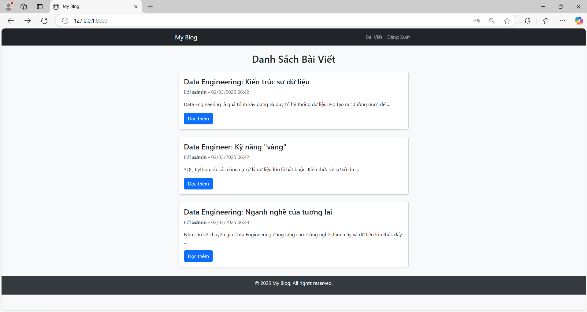

# 📌 Version 1 - Basic Blog Functionality

## 🔥 Tổng quan
Phiên bản đầu tiên của ứng dụng blog đã được phát triển với các chức năng cơ bản như:
- Hiển thị danh sách bài viết
- Hiển thị chi tiết bài viết
- Giao diện đơn giản sử dụng Bootstrap
- Sử dụng Django ORM để quản lý bài viết

---

## ✨ Các tính năng chính

### ✅ 1. Hiển thị danh sách bài viết (`post_list`)
- Người dùng có thể xem tất cả các bài viết có trong hệ thống.
- Bài viết được hiển thị theo thứ tự thời gian mới nhất trước.
- Giao diện sử dụng Bootstrap để hiển thị danh sách bài viết đẹp mắt.

### ✅ 2. Xem chi tiết bài viết (`post_detail`)
- Khi click vào tiêu đề bài viết, người dùng sẽ được chuyển đến trang chi tiết bài viết.
- Trang chi tiết hiển thị đầy đủ nội dung bài viết, tác giả và ngày đăng.

### ✅ 3. Thiết kế giao diện cơ bản
- Sử dụng Bootstrap để tạo giao diện responsive.
- Tạo `base.html` để kế thừa trong các template con (`post_list.html`, `post_detail.html`).

---

## 🛠️ Các thay đổi chính
| STT | Mô tả Thay Đổi | Tệp ảnh hưởng |
|----|----------------|--------------|
| 1 | Tạo model `Post` để lưu trữ bài viết | `models.py` |
| 2 | Tạo view `post_list` để hiển thị danh sách bài viết | `views.py` |
| 3 | Tạo view `post_detail` để hiển thị nội dung bài viết | `views.py` |
| 4 | Thêm template `post_list.html` | `templates/blog/post_list.html` |
| 5 | Thêm template `post_detail.html` | `templates/blog/post_detail.html` |
| 6 | Tạo `urls.py` để định nghĩa đường dẫn | `urls.py` |
| 7 | Sử dụng Bootstrap để thiết kế giao diện | `base.html` |

---

## 📸 Screenshots

### 🖼️ 1. Danh sách bài viết (`post_list.html`)
> 

### 🖼️ 2. Chi tiết bài viết (`post_detail.html`)
> 

---

🔜 **Lên kế hoạch cho Version 2:**
✅ Thêm chức năng đăng nhập/đăng ký người dùng.
✅ Tạo form đăng nhập và đăng ký.
✅ Bảo vệ trang tạo bài viết chỉ dành cho người dùng đã đăng nhập.

