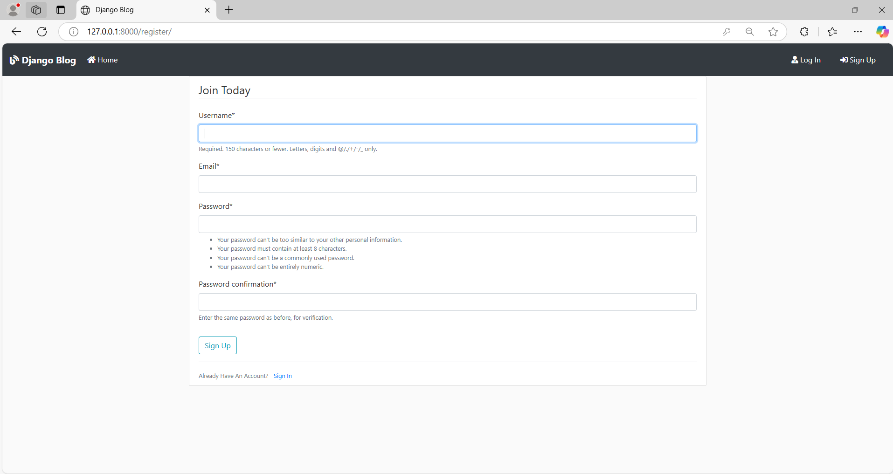
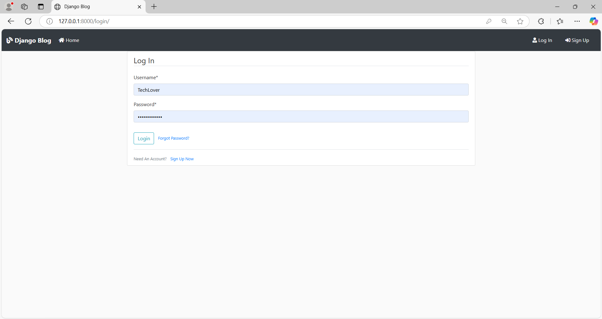
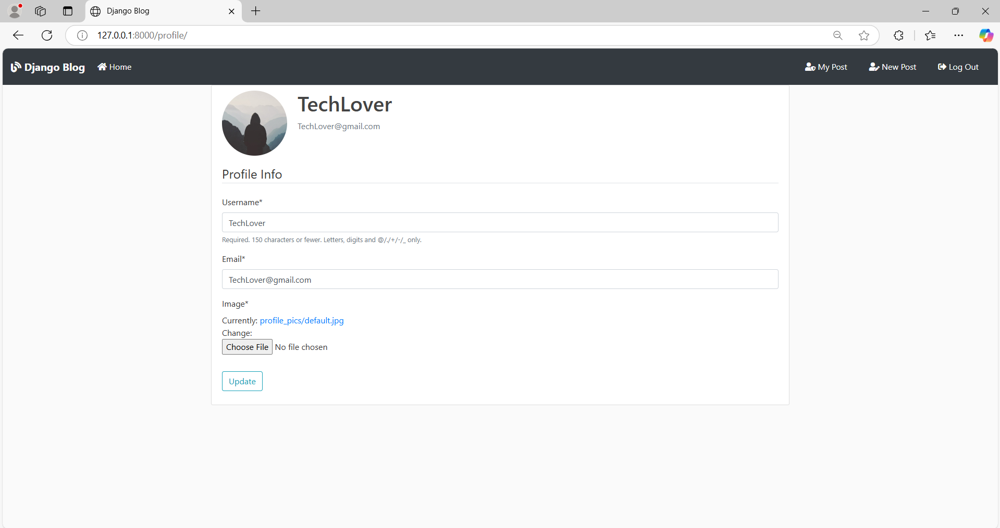

# 📌 Version 2 - User Registration and Login

## 🔥 Tổng quan
Phiên bản thứ hai của ứng dụng blog đã được phát triển với các chức năng đăng ký và đăng nhập người dùng. Người dùng có thể tạo tài khoản, đăng nhập và quản lý hồ sơ cá nhân.

---

## ✨ Các tính năng chính

### ✅ 1. Đăng ký người dùng (`register`)
- Người dùng có thể tạo tài khoản mới bằng cách cung cấp tên người dùng, email và mật khẩu.
- Sau khi đăng ký thành công, người dùng sẽ được chuyển hướng đến trang chủ và nhận thông báo xác nhận.

### ✅ 2. Đăng nhập người dùng (`login`)
- Người dùng đã đăng ký có thể đăng nhập vào hệ thống bằng tên người dùng và mật khẩu.
- Sau khi đăng nhập thành công, người dùng sẽ được chuyển hướng đến trang chủ.

### ✅ 3. Quản lý hồ sơ cá nhân (`profile`)
- Người dùng đã đăng nhập có thể cập nhật thông tin cá nhân và ảnh đại diện.
- Thông tin cá nhân bao gồm tên người dùng và email.

---

## 🛠️ Các thay đổi chính
| STT | Mô tả Thay Đổi | Tệp ảnh hưởng |
|----|----------------|--------------|
| 1 | Tạo form đăng ký người dùng | `forms.py` |
| 2 | Tạo view `register` để xử lý đăng ký người dùng | `views.py` |
| 3 | Tạo template `register.html` để hiển thị form đăng ký | `templates/users/register.html` |
| 4 | Tạo form đăng nhập người dùng | `forms.py` |
| 5 | Tạo view `login` để xử lý đăng nhập người dùng | `views.py` |
| 6 | Tạo template `login.html` để hiển thị form đăng nhập | `templates/users/login.html` |
| 7 | Tạo view `profile` để quản lý hồ sơ cá nhân | `views.py` |
| 8 | Tạo template `profile.html` để hiển thị và cập nhật hồ sơ cá nhân | `templates/users/profile.html` |

---

## 📸 Screenshots

### 🖼️ 1. Đăng ký người dùng (`register.html`)
> 

### 🖼️ 2. Đăng nhập người dùng (`login.html`)
> 

### 🖼️ 3. Quản lý hồ sơ cá nhân (`profile.html`)
> 

---

🔜 **Lên kế hoạch cho Version 3:**
✅ Admin có quyền khóa user (block) và reset mật khẩu cho user.
