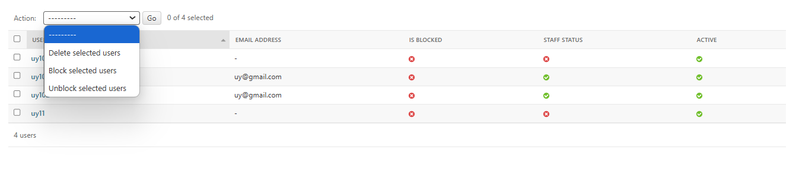
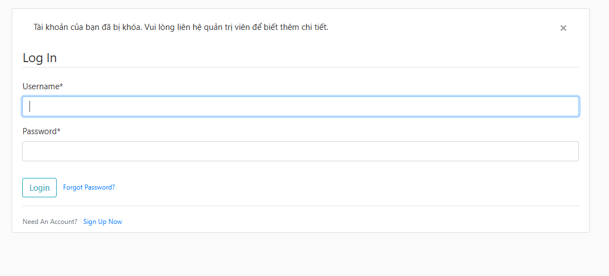
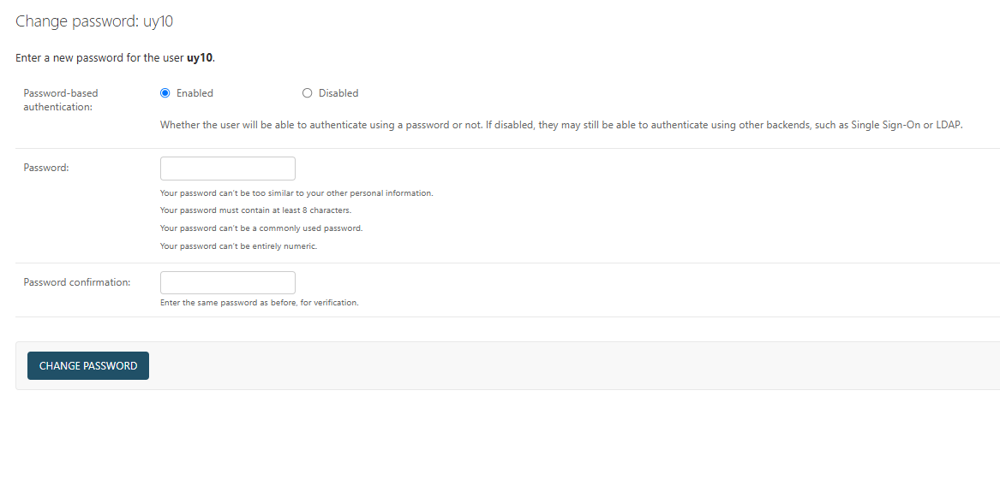

# 📌 Version 3 - Admin User Management

## 🔥 Tổng quan
Phiên bản thứ ba của ứng dụng blog đã được phát triển với các chức năng quản lý người dùng bởi Admin. Admin có quyền block, unblock và reset mật khẩu người dùng. Người dùng bị block sẽ không thể truy cập vào tài khoản của mình và sẽ nhận được thông báo tài khoản bị khóa.

---

## ✨ Các tính năng chính

### ✅ 1. Quản lý người dùng bởi Admin (`admin`)
- Admin có thể xem danh sách người dùng và trạng thái block của họ.
- Admin có thể block và unblock người dùng từ trang admin.
- Người dùng bị block sẽ không thể đăng nhập và sẽ nhận được thông báo tài khoản bị khóa.

### ✅ 2. Thông báo tài khoản bị khóa (`blocked_notification`)
- Khi người dùng bị block cố gắng đăng nhập, họ sẽ được chuyển hướng đến trang đăng nhập và nhận được thông báo tài khoản bị khóa.

### ✅ 3. Reset mật khẩu người dùng (`reset_password`)
- Admin có thể reset mật khẩu cho người dùng từ trang admin.

---

## 🛠️ Các thay đổi chính
| STT | Mô tả Thay Đổi | Tệp ảnh hưởng |
|----|----------------|--------------|
| 1 | Thêm trường `is_blocked` vào model `Profile` | `models.py` |
| 2 | Thêm chức năng block và unblock người dùng bởi Admin | `admin.py` |
| 3 | Thêm middleware để kiểm tra trạng thái block của người dùng | `middleware.py` |
| 4 | Cập nhật template `login.html` để hiển thị thông báo tài khoản bị khóa | `templates/users/login.html` |

---

## 📸 Screenshots

### 🖼️ 1. Trang quản lý người dùng bởi Admin (`admin`)
> 

### 🖼️ 2. Thông báo tài khoản bị khóa (`login.html`)
> 

### 🖼️ 3. Reset password
> 

---

🔜 **Lên kế hoạch cho Version 4:**
✅ Cho phép user có quyền quản lý bài viết (post) của mình