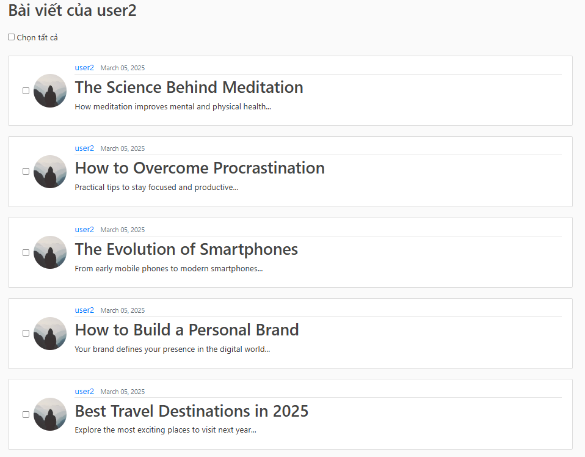
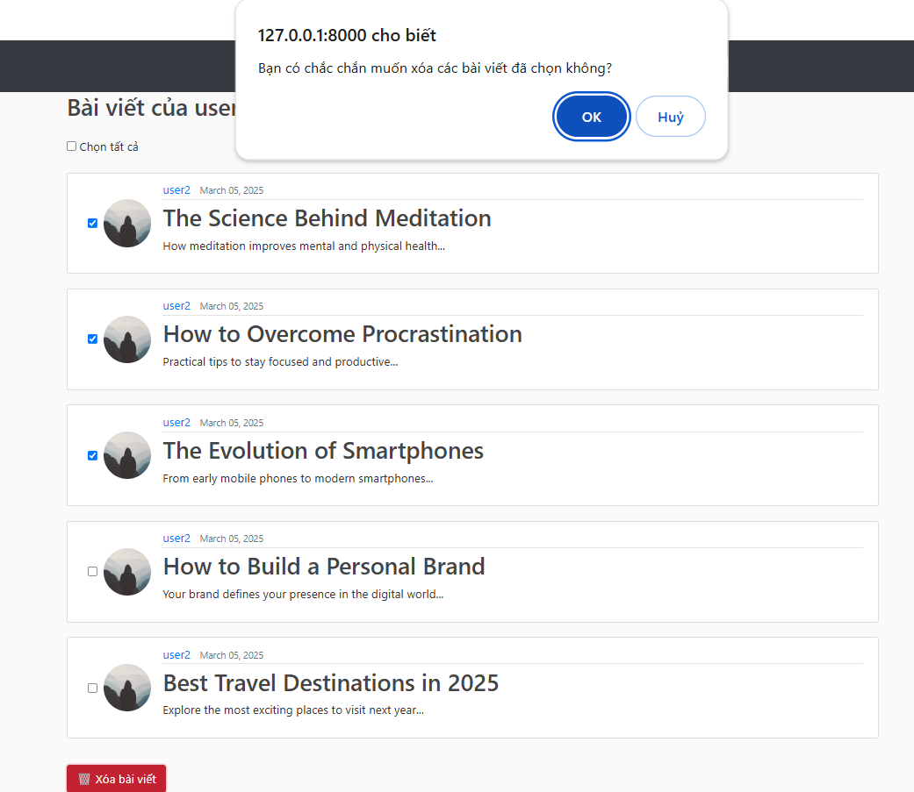

# 📌 Version 4 - User Post Management

## 🔥 Tổng quan
Phiên bản thứ tư của ứng dụng blog đã được phát triển với các chức năng cho phép người dùng quản lý bài viết (post) của mình. Người dùng có thể thực hiện thao tác xóa nhiều bài viết cùng lúc từ trang danh sách bài viết của riêng họ.

---

## ✨ Các tính năng chính

### ✅ 1. Quản lý bài viết của người dùng (`user_posts`)
- Người dùng có thể xem danh sách tất cả các bài viết của mình.
- Người dùng có thể chọn nhiều bài viết và xóa chúng cùng lúc.

### ✅ 2. Xóa nhiều bài viết cùng lúc (`delete_multiple_posts`)
- Người dùng có thể chọn nhiều bài viết từ danh sách bài viết của mình và xóa chúng cùng lúc.
- Xác nhận trước khi xóa để tránh thao tác nhầm.

---

## 🛠️ Các thay đổi chính
| STT | Mô tả Thay Đổi | Tệp ảnh hưởng |
|----|----------------|--------------|
| 1 | Thêm form để chọn nhiều bài viết và nút xóa | `templates/blog/user_posts.html` |
| 2 | Thêm view để xử lý yêu cầu xóa nhiều bài viết | `views.py` |
| 3 | Thêm đường dẫn URL cho view mới | `urls.py` |
| 4 | Cập nhật template `base.html` để hỗ trợ block `extra_js` | `templates/base.html` |

---

## 📸 Screenshots

### 🖼️ 1. Danh sách bài viết của người dùng (`user_posts.html`)
> 

### 🖼️ 2. Xóa nhiều bài viết cùng lúc (`user_posts.html`)
> 

---

🔜 **Lên kế hoạch cho Version 5:**
✅ Xây dựng chức năng phân trang (pagination).