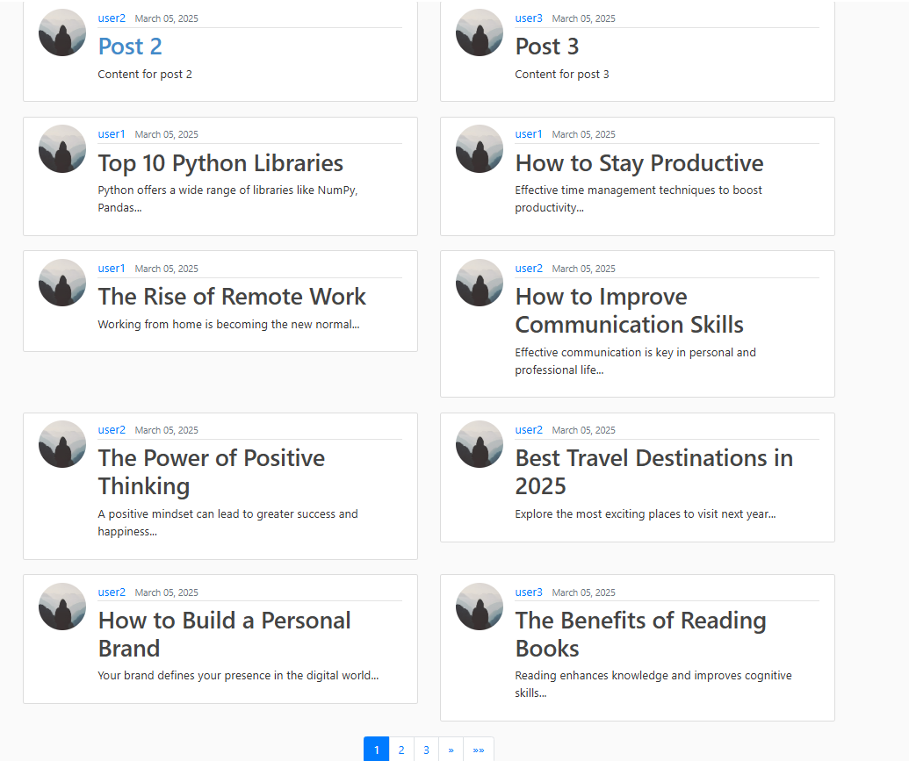

# 📌 Version 5 - Pagination Functionality

## 🔥 Tổng quan
Phiên bản thứ năm của ứng dụng blog đã được phát triển với chức năng phân trang (pagination). Chức năng này giúp người dùng dễ dàng duyệt qua danh sách bài viết (posts) hoặc nhiệm vụ (tasks) khi số lượng bài viết/nhiệm vụ lớn. Mặc định, mỗi trang sẽ hiển thị 10 bài viết/nhiệm vụ.

---

## ✨ Các tính năng chính

### ✅ 1. Phân trang danh sách bài viết (`post_list`)
- Danh sách bài viết được phân trang để hiển thị 10 bài viết trên mỗi trang.
- Người dùng có thể chuyển đổi giữa các trang để xem thêm bài viết.

### ✅ 2. Phân trang danh sách bài viết của người dùng (`user_posts`)
- Danh sách bài viết của người dùng cũng được phân trang để hiển thị 10 bài viết trên mỗi trang.
- Người dùng có thể chuyển đổi giữa các trang để xem thêm bài viết của mình.

---

## 🛠️ Các thay đổi chính
| STT | Mô tả Thay Đổi | Tệp ảnh hưởng |
|----|----------------|--------------|
| 1 | Cập nhật view `PostListView` để hỗ trợ phân trang | `views.py` |
| 2 | Cập nhật view `UserPostListView` để hỗ trợ phân trang | `views.py` |
| 3 | Cập nhật template `home.html` để hiển thị phân trang | `templates/blog/home.html` |
| 4 | Cập nhật template `user_posts.html` để hiển thị phân trang | `templates/blog/user_posts.html` |

---

## 📸 Screenshots

### 🖼️ 1. Phân trang danh sách bài viết (`home.html`)
> 

### 🖼️ 2. Phân trang danh sách bài viết của người dùng (`user_posts.html`)
> 

---